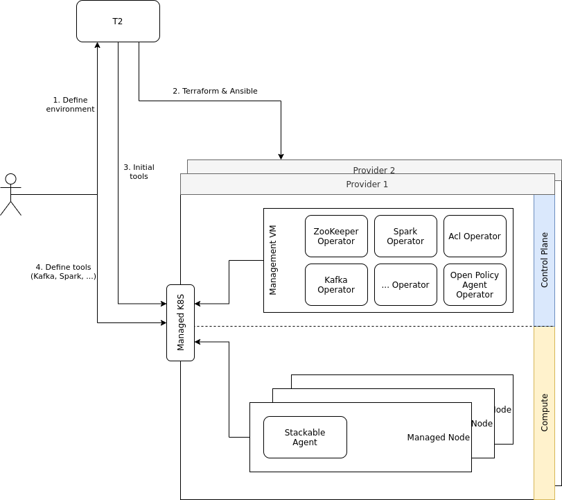

// Header of this document:

= T2 - Test & Troubleshooting Platform
:toc:
:toc-placement: preamble
:toclevels: 2
:showtitle:
:base-repo: https://github.com/stackabletech/t2
:imagesdir: diagrams

// Need some preamble to get TOC:
{empty}

image:https://github.com/stackabletech/t2/workflows/Build%20and%20Test/badge.svg[link="https://github.com/stackabletech/t2/actions"]

== Motivation

There are two situations in which we need to launch fully-fledged Stackable clusters:

* in our CI/CD pipelines' integration *tests*
* when we want to help customers with issues by reproducing their environments (*troubleshooting*)

== High Level Architecture
The following diagram shows at a very high level how T2 is integrated into the workflow of setting up a Stackable environment on a cloud provider.

1. The user sends a cluster definition to T2, this can optionally already include a definition of services that should be set up on the platform (see <<yaml>>).
2. T2 generates Terraform and Ansible code from this cluster definition and executes this against a cloud provider to instantiate VMs (4 in this example) and provision them with the base Stackable components.
3. After the base platform has been provisioned T2 acts as a Stackable client and posts the initial product config - if one was specified in the call to T2. +
From a technical point of view this means creating custom resources in the Kubernetes that backs the Stackable platform.
4. At this point the user can interact with the cluster via the kube-apiserver to add / remove / manage the needed tools.

== The two ways to create clusters with T2

A running T2 instance provides a restful API which provides you with two ways to create a cluster:

* The cluster can be launched by T2 inside a cloud infrastructure.
* You can download a package with all the required Terraform and Ansible files to launch the cluster using your own tools and cloud provider account.

While the former method is not publicly available to everyone and requires authentication, we are happy to provide the latter method free of charge and publicly accessible. Please understand that the scripts we provide come without any warranty.

[[yaml]]
== The Stackable cluster definition YAML

In either way you choose, you have to provide a definition of the Stackable cluster you want to create. You do this in a single YAML file. As of now, this Stackable cluster definition format is work in progress and the only documentation is the following example and the following table:

[source,yaml]
----
apiVersion: t2.stackable.tech/v1
kind: Infra
template: demo-debian-10
metadata: 
  name: stackable-demo
  description: "This is the cluster I want!"
domain: stackable.demo
publicKeys:
  - "ssh-rsa AAAAB3NzaC1..."
  - "ssh-rsa AAAACmtp4Ko..."
spec:
  region: de/fra
  cpuFamily: INTEL_XEON
  orchestrator:
    numberOfCores: 4
    memoryMb: 8192
    diskType: HDD
    diskSizeGb: 15
  nodes:
    main:
      numberOfNodes: 1
      numberOfCores: 2
      memoryMb: 8192
      diskType: HDD 
      diskSizeGb: 15
    worker:
      numberOfNodes: 4
      numberOfCores: 4
      memoryMb: 8192
      diskType: HDD 
      diskSizeGb: 15
services:
  spark-primary: |
    apiVersion: spark.stackable.tech/v1
    kind: SparkCluster
    metadata:
      name: spark-primary
    spec:
      master:
        selectors:
          - nodeName: "main-1.stackable.demo"
            instances: 1
            masterPort: 9999
            masterWebUiPort: 11111
      worker:
        selectors:
          - nodeName: "worker-1.stackable.demo"
            instances: 1
            cores: 1
            memory: "1g"
      historyServer:
        selectors:
          - nodeName: "worker-3.stackable.demo"
            instances: 1
      version: "3.0.1"
      maxPortRetries: 0
  spark-secondary: |
    apiVersion: spark.stackable.tech/v1
    kind: SparkCluster
    metadata:
      name: spark-secondary
    spec:
      master:
        selectors:
          - nodeName: "main-1.stackable.demo"
            instances: 1
            masterPort: 9998
            masterWebUiPort: 11112
      worker:
        selectors:
          - nodeName: "worker-2.stackable.demo"
            instances: 1
            cores: 1
            memory: "1g"
      historyServer:
        selectors:
          - nodeName: "worker-4.stackable.demo"
            instances: 1
      version: "3.0.1"
      maxPortRetries: 0        
----

[options="header"]
|=======
|key |description
|apiVersion |always `t2.stackable.tech/v1`
|kind |always `Infra`
|template |one of `demo-debian-10` or `demo-centos-7` depending on the desired OS
|metadata.name |name of the cluster
|metadata.description |description of the cluster
|domain |domain for DNS inside the cluster or when accessing through VPN
|publicKeys |list of SSH public keys to allow access to cluster nodes
|spec.region |one of the regions that the cloud vendor provides
|spec.cpuFamily |(optional) specify CPU-Family for all servers. The allowed values depend on the datacenter location you set up your cluster in. Please refer to your IONOS account for information about available CPUs and default values.
|spec.orchestrator |(optional) The orchestrator node is the Stackable node which hosts the operators. It is required, you cannot opt out of having one. It has reasonable defaults, but you can overwrite them with the config properties in this section. Be cautious not to configure an orchestrator which has too little power. See following entries for details.
|spec.orchestrator.numberOfCores |(optional) # of cores the orchestrator should have
|spec.orchestrator.memoryMb |(optional) amount of memory the orchestrator should have
|spec.orchestrator.diskType |(optional) type of disk the orchestrator should have
|spec.orchestrator.diskSizeGb |(optional) size of the disk of the orchestrator
|spec.nodes |map of node types with their specification
|spec.nodes.<type>.numberOfNodes |# of nodes of the given type
|spec.nodes.<type>.numberOfCores |# of cores each node of the given type should have
|spec.nodes.<type>.memoryMb |amount of memory each node of the given type should have
|spec.nodes.<type>.diskType | type of disk each node of the given type should have
|spec.nodes.<type>.diskSizeGb |size of the disk of the given node
|services |map of service descriptions as embedded YAMLs
|=======

The service descriptions depend on the used services. Please refer to the documentation of the operator for the product: 

* https://github.com/stackabletech/spark-operator[Apache Spark]
* https://github.com/stackabletech/zookeeper-operator[Apache ZooKeeper]
* https://github.com/stackabletech/kafka-operator[Apache Kafka]

== Using T2

At Stackable, we have a https://t2.stackable.tech/swagger-ui/[running instance of T2] to provision our own clusters. As described above, we use it for integration testing and troubleshooting and do not provide access publicly (except DIY, see below).

=== Create a cluster in T2's infrastructure

With a POST request to https://t2.stackable.tech/swagger-ui/#/cluster-controller/createClusterUsingPOST[this endpoint] you can create a new cluster. You have to provide the Stackable cluster definition as payload and a Token via the `t2-token` HTTP header to authenticate. The response is a description of the current cluster state.

To track the progress while the cluster is created, you can use https://t2.stackable.tech/swagger-ui/#/cluster-controller/getClusterUsingGET[this endpoint]. The desired state you want to wait for is `RUNNING`. (requires token as well)

To see in more detail what T2 is doing to create your cluster, you can https://t2.stackable.tech/swagger-ui/#/cluster-controller/getLogUsingGET[trace the output log here]. (requires token as well)

Once the cluster is up and running, you can download the https://t2.stackable.tech/swagger-ui/#/cluster-controller/getClientScriptUsingGET[Stackable client script]. This script provides you with a convenient way to access the cluster.

The script expects the private SSH key (matching one of the public keys in the Stackable cluster definition) to be in your keystore (`~/.ssh/` in Linux). If you keep it at another location, you can provide the path to the private key with the `-i` option.

To ssh into a host, just provide the hostname as the single parameter, e.g.

[source,bash]
----
./stackable.sh orchestrator
----

If you want to execute a command on the host, you can add it as a second param, e.g.

[source,bash]
----
./stackable.sh orchestrator "kubectl get nodes"
----

=== Create a cluster in your infrastructure

To create a cluster yourself, we offer what we call the *DIY option*. To use it, you can use https://t2.stackable.tech/swagger-ui/#/diy-cluster-controller/createClusterUsingGET[this service]. You have to provide a Stackable cluster definition as request body and get a ZIP file in return. This ZIP file comes with a `readme.txt` which explains the usage.

== Running T2

You can run T2 on premise if you like, but currently, we haven't put too much effort into making it conveniently reusable but merely built it to fit our very own needs. Nevertheless, this section might help if you want to run T2.

T2 is a Spring Boot application and can be packaged via Maven:

[source,bash]
----
mvn clean package
----

The resulting file `target/t2-server.jar` can be executed via Java:

[source,bash]
----
java -jar target/t2-server.jar [options]
----

The `options` are given in the form `--key1=value1 --key2=value2`. The option keys are described below.

=== Config options

The following table describes the config options of T2:

[options="header"]
|=======
|key |description |default value
|server.port |port of the HTTP server |`8080`
|t2.cluster-count-limit |max # of clusters that are provisioned at the same time |`5`
|t2.workspace.directory |directory where T2 stores the working dirs of the clusters |`/tmp/t2-workspace/`
|t2.templates.directory |directory where the T2 cluster templates are located |`./templates`
|t2.security.token.source |Source of the access token to secure T2. `file` means the token is stored in a file, `static` means it is provided as a property |`static`
|t2.security.token.file |location of the token file (see above) |`null`
|t2.security.token.static |security token (see above) |`t2-secret-token`
|t2.credential-file |File containing credentials in property format, e.g. `ionos_username` or `ionos_password` |`~/t2-credentials.properties`
|t2.dns.enabled |Should T2 create a DNS entry for the created cluster? Practically, this feature is not usable without our DNS provider account, so you should set it to `false` ;-) |`true`
|=======
